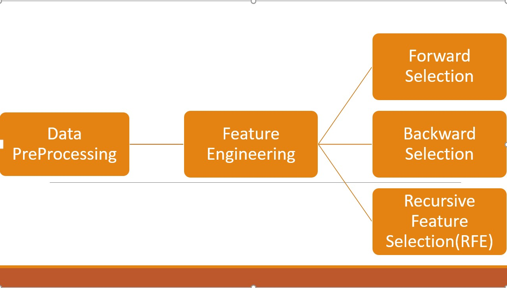

## Index
1. [Introduction](#Introduction)
2. [Workflow](#Workflow)
3. [Data PreProcessing](#Data-Preprocessing)
    1. [Missing Values](#1.-Missing-Values)
    2. [Outliers](#2.-Outliers)
    3. [Scaling](#3.-Scaling)
4. [Feature Selection](#Feature-Selection)
## Introduction
This project has been done to have a better understanding of what and how the house prices are decided.

In this project, I am  predicting the sale price of the houses using various machine learning algorithms. Housing sales price are determined by numerous factors such as material quality, living area square feet , Size of garage, location of the house number of bedrooms and so on. In particular, we focus on various features that usually applicants consider them. I have used the data of Kaggle website. Then used machine learning algorithms such as Ridge Regression, Lasso Regression and ElasticNet Regression to build the prediction model for houses to predict sale prices. Further, we have compared these algorithms based on RMSE parameter. Finally, to improve the accuracy of our model we blend the results.

## Workflow

## Data PreProcessing 
### 1. Missing Values 
Here we can see the percentage of the missing values.

We handle these missing values by replacing them if they are continuous variables or by removing them if there can’t be any logical solution to replace the null value with. If the variable itself contains more than 80% of the null data then that variable has to be dropped.
### 2. Outliers
Outliers are values that are much more than a specified range in which most of the values lies, they are known as outliers these outliers tend to disturb the learning of the model thus, they should be removed. so that the model which is built is learned on proper data. I have used the boxplot to represent the boxplot of each and every variable and used the IQR method to remove these outliers. 
### 3. Scaling 
Scaling is important after completely cleaning the data because all the variables should be in the same scale otherwise one variable woul get more or less importance if the scaling is not done 
After Scaling is done I saved the cleaned data in a different DataFrame 

### 4. Feature Selection 
In this process of feature selection I have to select the features which are best fit for the model and the workflow of feature selection is given below.

However we know that there are different features in each and every selection method but we don't know what might be their accuracy so we have to develop a linear regression model with all the three feature selection methods.This method of seeing which features are proper for the model is known as Hyperparameter tuning.

In Linear Regression we don't look for accuracy but we look at the adjusted R-square value it tells us how well the model is performing a standar rule is the r-square value should be greater than 0.7 atleast that means the model has learnt something.

1. In Forward Feature selection I got the adjusted RMSE value to be 0.719
2. In Backward selection I got the the adjusted RMSE value to be 0.894
3. In recursive Feature elimination I got the adjusted RMSE value to be 0.674

Since the ajusted RMSE value with backward selection is highest we will take it as our final model.
This is how the proble, of House Price Detection was solved 

## Thank you 

