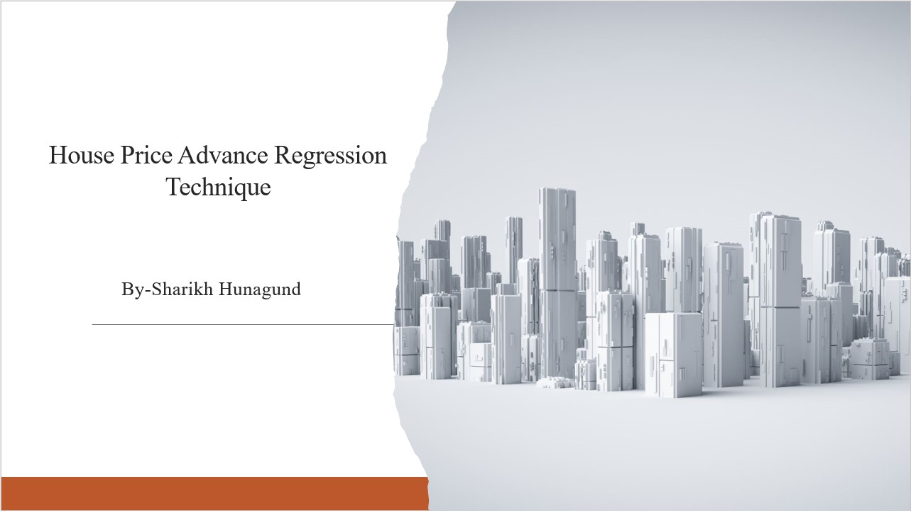
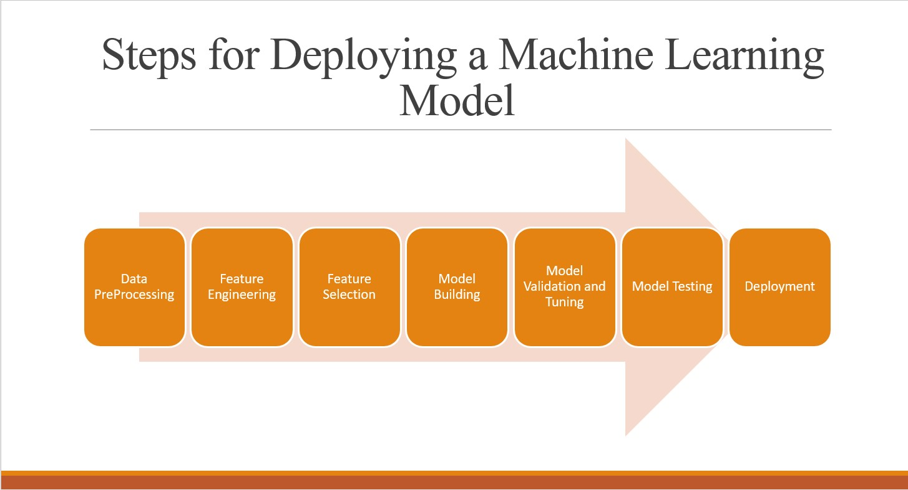
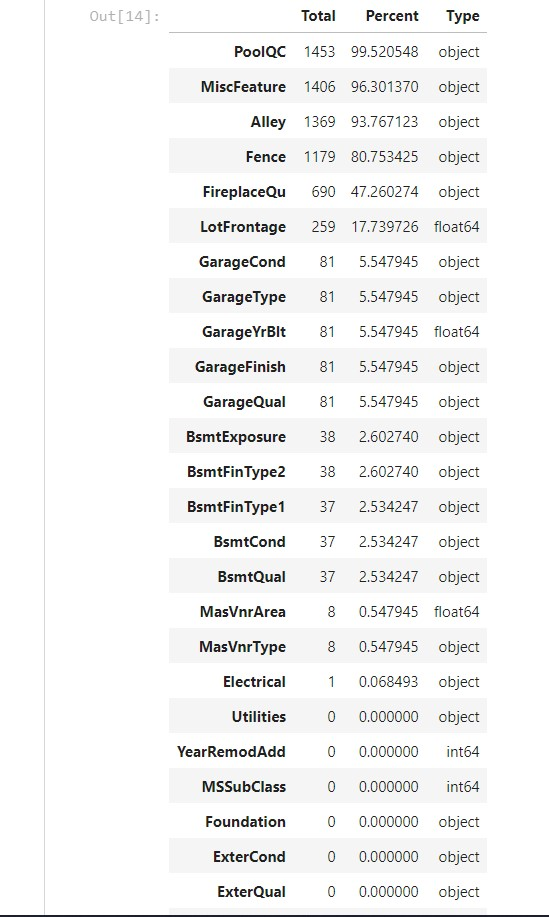
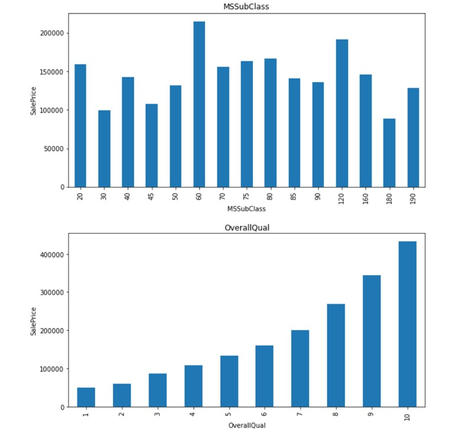
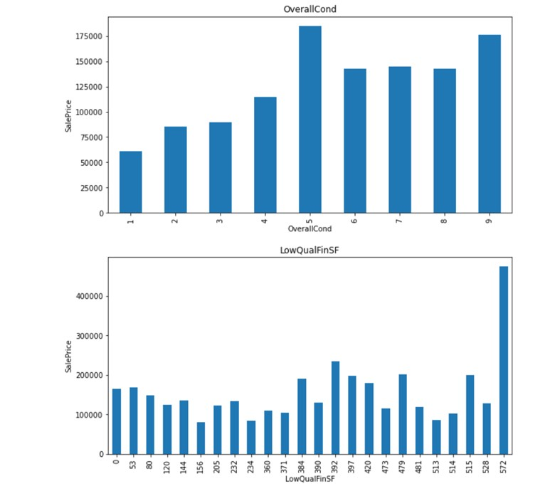
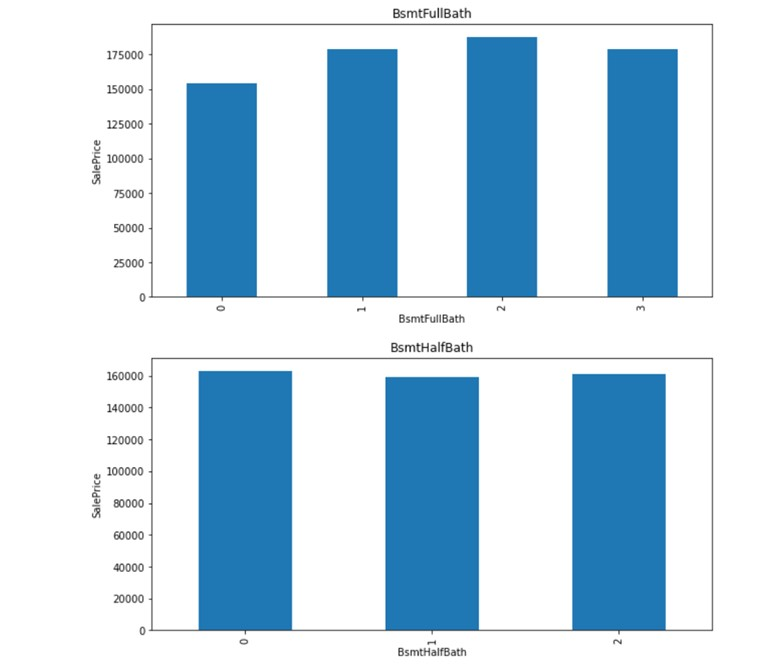

## Index
1. [Introduction](#Introduction)
2. [Workflow](#Workflow)
3. [DataPreprocessing](#DataPreprocessing)
   1. [Missing Values](#1.-Missing Values)
   2. [Distribution of the numerical variables](#2.-Distribution of the numerical variables )

## Introduction
This project has been done to have a better understanding of what and how the house prices are decided.

In this project, I am  predicting the sale price of the houses using various machine learning algorithms. Housing sales price are determined by numerous factors such as material quality, living area square feet , Size of garage, location of the house number of bedrooms and so on. In particular, we focus on various features that usually applicants consider them. I have used the data of Kaggle website. Then used machine learning algorithms such as Ridge Regression, Lasso Regression and ElasticNet Regression to build the prediction model for houses to predict sale prices. Further, we have compared these algorithms based on RMSE parameter. Finally, to improve the accuracy of our model we blend the results.

## Workflow

## Data PreProcessing 
### 1. Missing Values 
Here we can see the percentage of the missing values.

### 2. Distribution of the numerical variables  
In this we have seen the distribution of numerical variables with respect to salesprice

# Rest all variables are included in the ipynb file 

